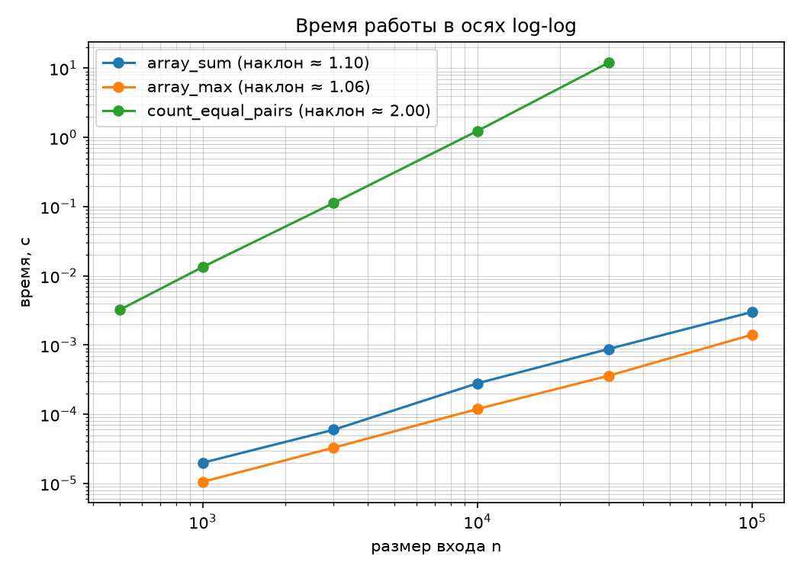
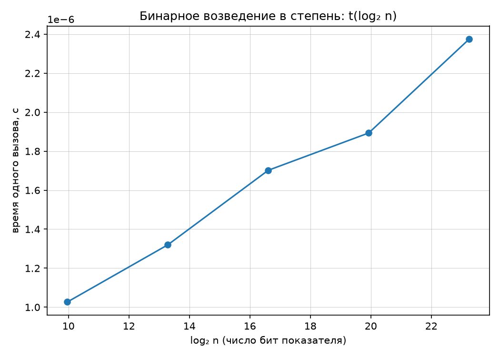

# Отчет по лабораторной работе № 1
## «Анализ временной сложности элементарных алгоритмов»

**Студент:** Завалов Максим Валерьевич  
**Группа:** БВТ2503  
**Вариант:** 12 (seed = 42)  

---

### 1. Как работают алгоритмы и какая у них сложность

* **Сумма элементов (`array_sum`)**:
  * Сложность: $O(n)$.
  * Объяснение: обычный цикл `for` проходит по каждому числу в списке и прибавляет его к переменной `total`. Сколько элементов в массиве ($n$), столько и действий. Дополнительная память не нужна ($O(1)$).
* **Поиск максимума (`array_max`)**:
  * Сложность: $O(n)$.
  * Объяснение: первое число берем за текущий максимум, а потом в цикле сравниваем его со всеми следующими. Всего получается $n - 1$ сравнений, поэтому время работы растет прямо пропорционально размеру массива. Память также $O(1)$.
* **Подсчет пар одинаковых чисел (`count_equal_pairs`)**:
  * Сложность: $O(n^2)$.
  * Объяснение: здесь два вложенных цикла. Первый берет элемент, а второй сравнивает его со всеми элементами правее. Число проверок считается по формуле суммы прогрессии: $\frac{n(n - 1)}{2}$. Так как здесь есть $n^2$, то при увеличении массива в 10 раз алгоритм работает примерно в 100 раз дольше.
* **Быстрое возведение в степень (`binary_pow`)**:
  * Сложность: $O(\log n)$.
  * Объяснение: вместо умножения $n$ раз подряд, мы в цикле делим степень на 2 на каждом шаге (`n //= 2`), а основание возводим в квадрат. Число шагов цикла равно примерно числу бит показателя степени ($\log_2 n$). Например, для степени $10^7$ нужно всего около 24 операций.

---

### 2. Как проверялась правильность работы (тесты и инварианты)

В функции `self_check` алгоритмы проверены по методике кафедры:
1. **Граничные случаи:** проверили пустой список `[]`, список из одного числа и возведение в нулевую степень ($x^0 = 1$).
2. **Сравнение со стандартным Python:** сгенерировали 200 случайных списков и сверили функции со встроенными `sum()`, `max()` и обычной функцией `pow()` — результаты полностью совпали.
3. **Проверка инвариантов (логических правил):**
   * Для `array_sum`: сумма склеенного списка равна сумме частей (`array_sum([1,2,3] + [4,5,6]) == array_sum([1,2,3]) + array_sum([4,5,6])`), а сумма четырех пятерок равна $4 \times 5 = 20$.
   * Для `array_max`: проверили через цикл, что найденное максимальное число не меньше любого элемента из этого списка.
   * Для `count_equal_pairs`: если все числа разные (`[1, 2, 3, 4, 5]`), то пар ровно 0; если все 4 числа одинаковые (`[7, 7, 7, 7]`), то пар строго $\frac{4 \times 3}{2} = 6$.
   * Для `binary_pow`: проверили сложение степеней при умножении ($2^3 \times 2^4 = 2^7$), в том числе с остатком по модулю, а также то, что 1 в любой степени остается 1.

---

### 3. Результаты замеров времени

Замеры проводились на macOS (ноутбук с Apple Silicon, вариант 12, seed = 42). Для каждой точки делался предварительный прогрев, затем 5 повторов и бралась медиана.

#### Таблица замеров для степенных алгоритмов
| Размер входа $n$ | `array_sum` (c) | `array_max` (c) | `count_equal_pairs` (c) |
| :---: | :---: | :---: | :---: |
| 500 | — | — | 0.003244 |
| 1 000 | 0.000020 | 0.000011 | 0.013414 |
| 3 000 | 0.000060 | 0.000033 | 0.113276 |
| 10 000 | 0.000280 | 0.000119 | 1.241971 |
| 30 000 | 0.000879 | 0.000360 | 12.023921 |
| 100 000 | 0.003009 | 0.001414 | — |

*(Точку 100 000 для подсчета пар исключили по заданию, так как замер занял бы более 15 минут).*

#### Таблица для бинарного возведения в степень
*(Считалось пачками по 20 000 вызовов, время пересчитано на 1 вызов, по модулю $1\,000\,000\,007$)*

| Степень $n$ | Число бит ($\log_2 n$) | Время одной операции (с) |
| :---: | :---: | :---: |
| 1 000 | 10.0 | 0.000001027 |
| 10 000 | 13.3 | 0.000001320 |
| 100 000 | 16.6 | 0.000001702 |
| 1 000 000 | 19.9 | 0.000001893 |
| 10 000 000 | 23.3 | 0.000002375 |

---

### 4. Ответы на вопросы и выводы по графикам

1. **Что показали графики в осях log-log (`lab01_loglog.png`):**
   * В логарифмических шкалах график степенной функции превращается в прямую линию, а наклон показывает порядок роста.
   * По замерам получилось:
     * `count_equal_pairs`: наклон **1.998** (почти ровно 2.00, что идеально совпадает с теоретической сложностью $O(n^2)$).
     * `array_sum` и `array_max`: наклоны составили **1.105** и **1.058** (около 1.0, сложность $O(n)$).
   * Небольшое отклонение от единицы на больших массивах ($n = 100\,000$) связано с тем, что массив перестает помещаться в самый быстрый кэш L1/L2 процессора и идут обращения к оперативной памяти RAM, плюс сказываются накладные расходы цикла виртуальной машины Python.

2. **Почему для степени график построен от $\log_2 n$, а не в log-log (`lab01_binary_pow.png`):**
   * Если строить график логарифма в осях log-log, он становится почти плоской горизонтальной линией, по которой вообще не видно порядка роста.
   * А если по оси $X$ отложить количество бит показателя степени ($\log_2 n$), получается прямая линия. Это доказывает, что время работы алгоритма напрямую зависит от количества бит в числе.
3. **Зачем в замеры степени добавлен остаток по модулю (`POW_MOD`):**
   * В Python числа могут быть бесконечной длины. Если возводить в степень 10 миллионов без остатка, получится гигантское число на миллионы знаков. Компьютер потратит все ресурсы на перемножение этих громадных чисел, а не на сам алгоритм.
   * Модуль держит числа в пределах машинного слова, поэтому умножение всегда занимает $O(1)$ времени, и мы честно замеряем скорость самого алгоритма.