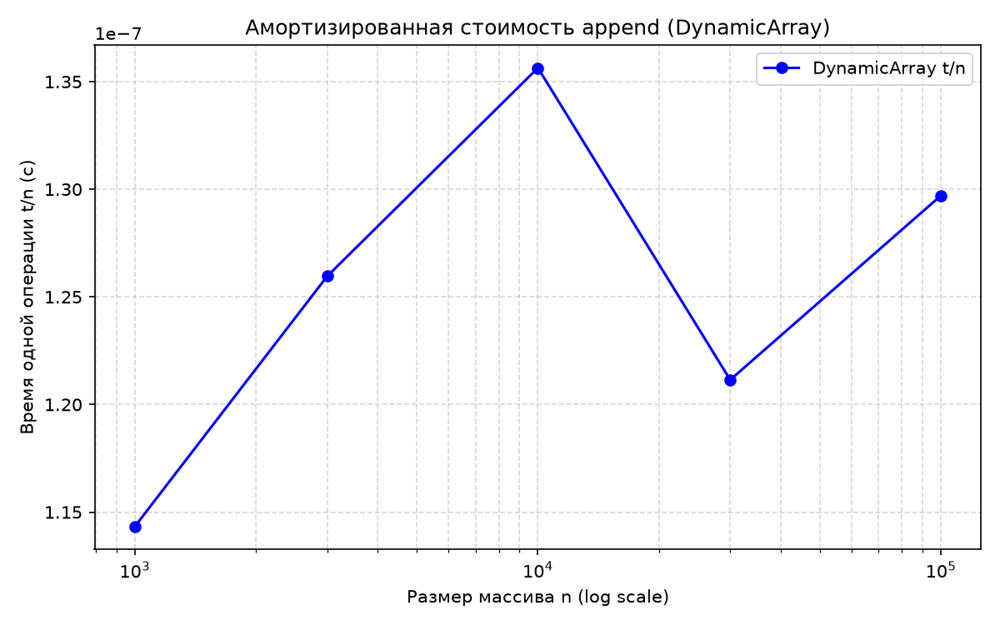
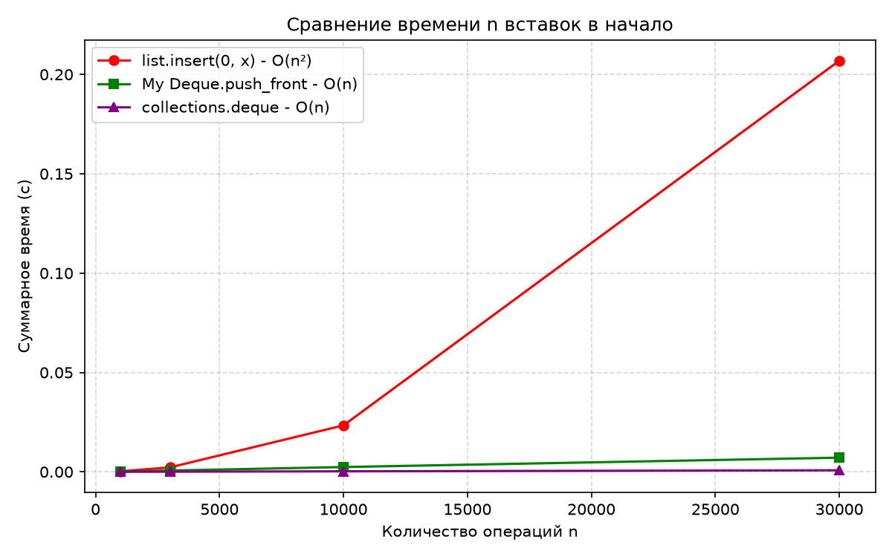

# Отчет по лабораторной работе № 2
## «Реализация рекурсивных функций и динамического массива, стека и дека»

**Студент:** Завалов Максим Валерьевич  
**Группа:** БВТ2503  
**Вариант:** 12 (seed = 42)  

---

### 1. Анализ рекурсивных функций и подсчет вызовов

В первой части работы исследованы рекурсивные алгоритмы, их базовые условия, глубина стека и влияние мемоизации на асимптотическую сложность.

* **Факториал (`factorial`)**:
  * **Сложность:** $O(n)$ по времени, $O(n)$ по памяти (глубина стека вызовов).
  * **Описание:** Базовое условие — $n \in \{0, 1\}$, возвращает 1. Рекурсивный шаг: $n! = n \times (n - 1)!$. Вызовы образуют линейную цепочку в стеке вызовов глубиной $n$.

* **Числа Фибоначчи: наивная рекурсия (`fib_naive`) против мемоизации (`fib_memo`)**:
  * **`fib_naive`:** сложность $O(2^n)$ по времени ($O(\phi^n)$, где $\phi \approx 1.618$), память стека $O(n)$. Каждый вызов разветвляется на две независимые подзадачи: $F(n) = F(n-1) + F(n-2)$, приводя к колоссальному числу повторных вычислений одних и тех же значений.
  * **`fib_memo`:** сложность $O(n)$ по времени, $O(n)$ по памяти (стек вызовов + словарь `memo`). Результат каждого вычисленного $F(k)$ сохраняется в кеш-словарь и при повторном обращении возвращается за $O(1)$.
  * **Сравнение счетчиков вызовов (`CALLS`):**
    | $n$ | Вызовы `fib_naive` | Вызовы `fib_memo` | Отношение сокращения |
    | :---: | :---: | :---: | :---: |
    | 5 | 15 | 9 | 1.7× |
    | 10 | 177 | 19 | 9.3× |
    | 15 | 1 973 | 29 | 68.0× |
    | 20 | 21 891 | 39 | 561.3× |
    Число вызовов `fib_memo` растет строго линейно как $2n - 1$, тогда как в `fib_naive` наблюдается экспоненциальный взрыв.

* **Ханойские башни (`hanoi`)**:
  * **Сложность:** $O(2^n)$ по времени, $O(n)$ по памяти стека.
  * **Описание:** Алгоритм декомпозирует задачу на 3 шага: перенести $n-1$ диск на вспомогательный стержень, переместить 1 самый большой диск на целевой, затем вернуть $n-1$ диск на целевой.
  * Рекуррентное соотношение: $T(n) = 2T(n-1) + 1$, с базовым случаем $T(0) = 0$. Его точное аналитическое решение:
    $$T(n) = 2^n - 1$$
  * В `self_check` проверено выполнение соотношения для $n \in \{0, 1, 3, 8\}$: $0, 1, 7, 255$ ходов соответственно.

---

### 2. Реализация линейных структур данных и их инварианты

* **Динамический массив (`DynamicArray`)**:
  * Реализован поверх фиксированного буфера памяти `[None] * capacity` без использования встроенных методов `list.append` и `insert`.
  * **Инвариант структуры:** $0 \le \text{size} \le \text{capacity}$. Пользователю доступны только индексы в полуинтервале $[0, \text{size})$, обращение к остальным ячейкам буфера вызывает `IndexError`.
  * **Стратегия расширения:** при переполнении ($\text{size} == \text{capacity}$) вызывается `_grow()`, выделяющий новый буфер удвоенного размера ($2 \times \text{capacity}$) и копирующий старые данные.

* **Стек (`Stack`)**:
  * Реализован на базе `DynamicArray` по принципу **LIFO** (Last In, First Out).
  * Операции `push` делегируются в `DynamicArray.append` ($O(1)$ амортизировано), а `pop` и `peek` работают с последним элементом за строгое $O(1)$.

* **Дек (`Deque`)**:
  * Реализован на базе **двусвязного списка** из узлов `_Node(value, prev, next)`.
  * Имеет указатели на голову (`_head`) и хвост (`_tail`).
  * Все 4 операции добавления и удаления на концах (`push_front`, `push_back`, `pop_front`, `pop_back`) выполняются за **строгое $O(1)$** без амортизации, путем локальной перелинковки ссылок.
  * Корректно обработаны граничные случаи: переход от пустого дека к одноэлементному и очистка ссылок до `None` при удалении единственного элемента.

---

### 3. Амортизированный анализ `append` методом учёта (банковским методом)

Метод бухгалтерского учета (accounting method) приписывает каждой операции амортизированную учетную стоимость $\hat{c}_i$, которая может отличаться от ее фактической стоимости $c_i$. Разность $\hat{c}_i - c_i$ накапливается как «кредит» (потенциал), расходуемый в моменты дорогостоящих операций копирования.

#### Схема начисления кредита:
1. Пусть текущая ёмкость массива равна $k$, и буфер только что был расширен (в нем $k/2$ старых элементов и $k/2$ свободных мест).
2. Назначаем амортизированную стоимость операции `append`:
   $$\hat{c} = 3 \text{ монеты}$$
3. Распределение 3 монет при вставке каждого из следующих $k/2$ элементов:
   * **1 монета** расходуется немедленно на фактическую запись элемента в ячейку памяти.
   * **1 монета** кладется в депозит на сам добавленный элемент (для оплаты его будущего копирования при следующем расширении).
   * **1 монета** кладется в депозит на один из старых элементов первой половины массива (который уже исчерпал свой депозит).
4. К моменту, когда свободные $k/2$ ячеек заполнятся и массив снова достигнет предела $k$, на каждом из $k$ элементов будет лежать ровно по 1 монете депозита.
5. Накопленного кредита в объеме $k$ монет в точности хватает, чтобы оплатить копирование всех $k$ элементов в новый буфер удвоенного размера $2k$.

Баланс кредита всегда положителен ($\sum (\hat{c}_i - c_i) \ge 0$), следовательно, средняя стоимость добавления элемента составляет строго **$O(1)$**.

---

### 4. Результаты замеров времени и анализ графиков

Замеры проводились на macOS (Apple Silicon, вариант 12, seed = 42). Время вычислялось как медиана 5 независимых запусков с предварительным прогревом кэша.

#### Таблица 1. Амортизированная стоимость `append` в `DynamicArray`
| Число элементов $n$ | Суммарное время $t$ (с) | Время одной операции $t/n$ (с) |
| :---: | :---: | :---: |
| 1 000 | 0.000114 | $1.143 \times 10^{-7}$ |
| 3 000 | 0.000378 | $1.260 \times 10^{-7}$ |
| 10 000 | 0.001356 | $1.356 \times 10^{-7}$ |
| 30 000 | 0.003634 | $1.211 \times 10^{-7}$ |
| 100 000 | 0.012971 | $1.297 \times 10^{-7}$ |

**Анализ графика 1 (`lab02_append_amortized.png`):**
* Значение $t/n$ на интервале размеров от $10^3$ до $10^5$ колеблется в узком диапазоне $(1.14 - 1.36) \times 10^{-7}$ секунды на операцию.
* Кривая на логарифмической шкале представляет собой горизонтальную линию с незначительными системными колебаниями (кэш-эффекты процессора). Это экспериментально подтверждает теоретическую оценку **амортизированной сложности $O(1)$**.

---

#### Таблица 2. Сравнение вставки в начало: `list.insert(0)` vs `Deque`
| Размер $n$ | Встроенный `list.insert(0)` (с) | Собственный `Deque.push_front` (с) | Встроенный `collections.deque` (с) |
| :---: | :---: | :---: | :---: |
| 1 000 | 0.000261 | 0.000191 | 0.000022 |
| 3 000 | 0.002232 | 0.000641 | 0.000071 |
| 10 000 | 0.023375 | 0.002402 | 0.000247 |
| 30 000 | 0.206916 | 0.007117 | 0.000757 |

**Анализ графика 2 (`lab02_insert_front.png`):**
1. **Квадратичный рост встроенного `list`:**
   * Время выполнения $n$ операций `list.insert(0, x)` демонстрирует ярко выраженную параболическую зависимость ($O(n^2)$ суммарно). При росте $n$ в 30 раз (с 1 000 до 30 000) время выросло почти в 800 раз (с 0.00026 с до 0.207 с).
   * Причина: `list` в Python — это динамический массив. Вставка в нулевую позицию требует побайтового сдвига всех существующих элементов на 1 позицию вправо, что стоит $O(n)$ на одну вставку.
2. **Линейный рост деков:**
   * Оба дека (`My Deque` и `collections.deque`) показывают строгую прямую зависимость суммарного времени от $n$, что подтверждает **$O(1)$ на отдельную операцию**.
   * Причина: в двусвязном списке не требуется перемещать данные; вставка сводится к созданию узла и перепривязке ссылок головы за константное число шагов.
3. **Разница между `My Deque` и `collections.deque`:**
   * Наш дек медленнее библиотечного примерно в 9–10 раз. Это объясняется тем, что `collections.deque` написан на языке C и использует блоки (массивы) фиксированного размера (chunked array-of-blocks), а наш класс работает на чистом Python с динамическим созданием объектов `_Node` в куче.

---

### 5. Ответы на контрольные вопросы для защиты

1. **Зачем рекурсивной функции базовое условие и как устроен стек вызовов; что произойдёт при его отсутствии?**
   * **Базовое условие** необходимо для остановки рекурсивного спуска. Это тривиальный случай, ответ для которого известен заранее.
   * **Стек вызовов (Call Stack)** хранит контекст каждого активного вызова функции: локальные переменные, аргументы и адрес возврата (фрейм активации). При каждом вызове фрейм кладется на вершину стека, а при `return` — снимается.
   * Без базового условия функция вызывает сама себя бесконечно, пока не исчерпает лимит глубины стека виртуальной машины Python, что приводит к аварийному исключению `RecursionError: maximum recursion depth exceeded`.

2. **Сформулируйте мастер-теорему для рекуррент вида $T(n) = aT(n/b) + f(n)$ и приведите примеры для каждого из трёх случаев.**
   Мастер-теорема сравнивает сложность разделения/слияния $f(n)$ с критической функцией $n^{\log_b a}$:
   * **Случай 1 (доминируют листья):** если $f(n) = O(n^{\log_b a - \epsilon})$ при $\epsilon > 0$, то $T(n) = \Theta(n^{\log_b a})$.  
     *Пример:* алгоритм Карацубы для умножения чисел: $T(n) = 3T(n/2) + O(n) \implies T(n) = \Theta(n^{\log_2 3}) \approx \Theta(n^{1.585})$.
   * **Случай 2 (баланс на всех уровнях):** если $f(n) = \Theta(n^{\log_b a})$, то $T(n) = \Theta(n^{\log_b a} \log n)$.  
     *Пример:* сортировка слиянием (Merge Sort): $T(n) = 2T(n/2) + O(n) \implies T(n) = \Theta(n \log n)$.
   * **Случай 3 (доминирует корень):** если $f(n) = \Omega(n^{\log_b a + \epsilon})$ и выполняется условие регулярности $a f(n/b) \le c f(n)$ при $c < 1$, то $T(n) = \Theta(f(n))$.  
     *Пример:* $T(n) = 2T(n/2) + n^2 \implies T(n) = \Theta(n^2)$.

3. **Проведите амортизированный анализ добавления в динамический массив с ростом ёмкости ×2; почему средняя стоимость операции O(1), хотя отдельная операция может стоить O(n)?**
   * При вставке $n$ элементов дорогая операция $O(n)$ (выделение буфера и копирование) происходит экспоненциально редко — только при размерах $1, 2, 4, 8, \dots, 2^{\lfloor\log_2 n\rfloor}$.
   * Суммарная стоимость копирования всех элементов за все расширения составляет:
     $$1 + 2 + 4 + 8 + \dots + \frac{n}{2} < n$$
   * Суммарные затраты на $n$ вставок складываются из $n$ элементарных записей в память и менее чем $n$ копирований:
     $$T_{\text{total}}(n) = n + \sum_{\text{копирования}} < 2n$$
   * Усредняя по $n$ операциям, получаем амортизированную стоимость одной вставки:
     $$\frac{T_{\text{total}}(n)}{n} < \frac{2n}{n} = O(1)$$

4. **Сравните затраты вставки в начало динамического массива и двусвязного списка; какие накладные расходы есть у списка, несмотря на O(1) на операцию?**
   * **Вставка в начало:**
     * Динамический массив: требует сдвига всех $n$ элементов вправо на 1 позицию $\implies O(n)$.
     * Двусвязный список: требует лишь создания нового узла и перепривязки 2–3 указателей $\implies O(1)$.
   * **Накладные расходы двусвязного списка:**
     * **Память (Memory Overhead):** на каждый элемент помимо полезной нагрузки хранятся два указателя (`prev` и `next`) и заголовок объекта Python. В 64-битном Python один узел списка занимает порядка 48–56 байт, тогда как массив хранит компактный непрерывный буфер ссылок по 8 байт на элемент.
     * **Кэш-локальность (Cache Locality):** элементы динамического массива расположены в памяти непрерывно, поэтому они целиком подгружаются в быстрые кэш-линии процессора (L1/L2). Узлы связного списка разбросаны по разным адресам оперативной памяти, что вызывает постоянные промахи кэша (cache misses) и замедляет последовательный обход.
